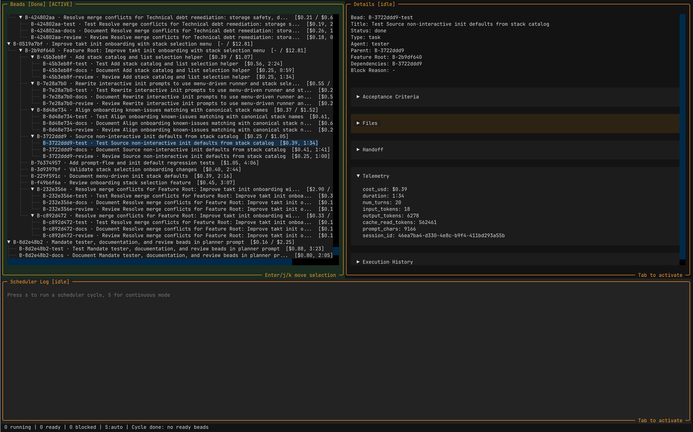

# Takt


**Takt** is an agentic system for orchestrating specialized AI coding workers (Codex or Claude Code) against a Git-native task graph.

AI coding agents are powerful but undisciplined — they skip tests, forget documentation, and lose context across long tasks. Takt enforces a structured development process: every feature is decomposed into discrete units of work called **beads**, each assigned to a specialized agent type with a defined role and guardrails. Nothing gets skipped because the scheduler won't let it.

Takt is intentionally opinionated. Spec-driven development — writing a human-readable spec before any code is written — is optional but strongly recommended: it forces clarity upfront and gives agents the context they need to make good decisions. The [spec-management skill](https://github.com/oscarrenalias/skill-spec-management) complements the process by providing a structured workflow for writing, planning, and tracking specs through to completion. It is included in the skill catalog installed by `takt init` for Claude Code projects.

## Key features
- **Structured pipeline** — every feature flows through planning, implementation, testing, documentation, and review. Agents cannot skip steps or drift out of scope.
- **Git-native isolation** — each bead runs in its own Git worktree, so parallel agents never step on each other.
- **Self-healing** — blocked beads, merge conflicts, and test failures automatically create corrective work items rather than silently failing.
- **Backend-agnostic** — works with Claude Code or Codex; switch with a flag or environment variable.
- **Multi-project orchestration** — coordinate work across many takt projects from one place via the sibling `takt-fleet` CLI: fan out ad-hoc beads, trigger runs, aggregate status, and keep an audit log of every fleet operation.
- **Observable** — a terminal UI, telemetry, and structured JSON handoffs give full visibility into what agents are doing and why.

---

## Core concepts

**Beads** are the unit of work — a self-contained task with a title, description, assigned agent type, and a lifecycle: `open` → `ready` → `in_progress` → `done` (or `blocked`). Every feature is decomposed into a graph of beads by the planner. Bead state is stored as JSON files inside `.takt/beads/` and is version-controlled alongside your code.

**Agent types** define the role and guardrails for each bead:

| Type | Role |
|------|------|
| `developer` | Writes and modifies code |
| `tester` | Writes and runs tests |
| `documentation` | Updates docs and memory files |
| `review` | Reviews changes; produces an `approved` / `needs_changes` verdict |
| `planner` | Decomposes a spec into a bead graph |
| `recovery` | Auto-created when an agent fails to produce structured output |

When a developer bead completes, the scheduler automatically creates tester, documentation, and review followup beads — you don't wire these up manually.

---

## For Users

### Prerequisites

Before installing, make sure the following are in place:

1. **Git repository** — the target directory must be a git repo (`git init` if needed).
2. **Agent runner CLI** — install the backend you plan to use:
   - Claude Code: `npm install -g @anthropic-ai/claude-code`
   - Codex: `npm install -g @openai/codex`
3. **Python 3.11+** and [`uv`](https://docs.astral.sh/uv/) (recommended) or `pip`.

### Install

**With `uv` (recommended):**
```bash
uv tool install agent-takt
```

**With `pip`:**
```bash
pip install agent-takt
```

Installing `agent-takt` puts both `takt` (the per-project orchestrator) and `takt-fleet` (the cross-project manager) on your PATH — no separate install needed.

Verify the install:
```bash
takt --version
takt-fleet --version
```

### Initialise a project

Run from the root of your git repository — new or existing:

```bash
takt init
```

This starts an interactive prompt: choose your runner backend (Claude Code or Codex), parallel worker count, and project stack. Takt supports Python, Node.js, TypeScript, Go, Rust, and Java (Maven) out of the box, with pre-filled test and build commands for each. Select **Other** to enter custom commands.

`takt init` is safe to run on any existing project. It only adds new files and never modifies your existing code. It updates `.gitignore`, seeds `docs/memory/` with project conventions files, installs guardrail templates, and creates a single commit (`chore: takt init scaffold`).

Once installed, verify the setup:
```bash
takt summary
```

This should print bead counts (all zeros on a fresh project) without errors.

### Working with Specs

The typical workflow: write a spec, let the planner decompose it into beads, run the scheduler to execute them.

**1. Write a spec** describing what you want built. Specs are Markdown files in `specs/drafts/`. They work best when they are concrete: include an objective, the specific changes needed, and verifiable acceptance criteria. Example:

```markdown
## Objective
Add a /health endpoint that returns {"status": "ok"} with HTTP 200.

## Changes
- Add GET /health route to src/app.py
- Return {"status": "ok"} as JSON

## Acceptance Criteria
- GET /health returns HTTP 200
- Response body is {"status": "ok"}
- All existing tests still pass
```

Use the [spec-management skill](https://github.com/oscarrenalias/skill-spec-management) (included in Claude Code projects by `takt init`) to create and manage specs through their lifecycle.

**2. Plan and run:**

```bash
# Dry run — prints bead graph but creates nothing
takt plan specs/drafts/my-feature.md

# Persist beads (required to actually create the work items)
takt plan --write specs/drafts/my-feature.md

# Start the scheduler — workers pick up ready beads automatically
takt --runner claude run --max-workers 4

# Monitor progress
takt summary
takt tui
```

The planner creates a feature root bead with developer child beads, each scoped to a focused change. When a developer bead completes, the scheduler automatically creates tester, documentation, and review followup beads.

When all beads in a feature are done, merge the feature branch:

```bash
takt merge <feature_root_bead_id>
```

### Terminal UI

Run `takt tui` for a live view of the bead graph, agent output, and scheduler state:



### Key Commands

```bash
takt --version                           # print installed version
takt summary                             # counts + next actionable beads
takt summary --feature-root B0030        # scoped to one feature
takt bead list --plain                   # all beads as table
takt bead show <id>                      # single bead details (JSON)
takt bead graph                          # Mermaid diagram of all beads
takt bead graph --feature-root <id>      # scoped to one feature
takt bead graph --output graph.md        # write diagram to file
takt --runner claude run                 # run all beads to quiescence
takt --runner claude run --max-workers 4 # parallel workers
takt retry <bead_id>                     # requeue a blocked bead
takt merge <bead_id>                     # merge a done feature
takt merge <bead_id> --skip-rebase       # skip merge-main preflight
takt merge <bead_id> --skip-tests        # skip test gate
takt tui                                 # interactive terminal UI
takt upgrade                             # upgrade takt-managed assets to current bundled version
takt upgrade --dry-run                   # preview what upgrade would change without writing
takt asset list                          # show all tracked assets and their status
takt asset mark-owned <glob>             # protect matching assets from future upgrades
takt asset unmark-owned <glob>           # re-enable upgrade management for matching assets
```

### Creating Beads Directly

For one-off tasks, create a bead without a spec:

```bash
takt bead create \
  --title "Add feature X" \
  --agent developer \
  --description "Implement X by modifying src/foo.py"
```

### Merge Safety

The `takt merge` command runs two preflight checks before merging to main:

1. **Merge-main preflight** (skippable with `--skip-rebase`): Merges the current `main` branch into your feature branch to catch conflicts early. If conflicts are detected, a `merge-conflict` bead is created for you to resolve.

2. **Test gate** (skippable with `--skip-tests`): Runs your configured test suite to validate the merge. Test failures also create a `merge-conflict` bead.

If a conflict bead is created, run the scheduler to resolve it, then retry:

```bash
takt --runner claude run
takt merge <feature_root_bead_id>
```

Merge-conflict beads track the specific files involved, appear as `open` and ready for a developer to fix, and block the merge until resolved.

Configure the test gate in `.takt/config.yaml`:

```yaml
common:
  test_command: "uv run pytest tests/ -n auto -q"
  test_timeout_seconds: 120
```

### Shared Agent Memory

Takt seeds two memory files at `takt init` time that agents read at runtime:

- `docs/memory/conventions.md` — project coding conventions, architecture notes, and decisions agents should follow
- `docs/memory/known-issues.md` — known bugs, quirks, or workarounds relevant to your stack

Keep these up to date as your project evolves. They are not managed by `takt upgrade` and are never overwritten.

### Configuration

Runtime config lives in `.takt/config.yaml`. The default backend is `codex`; switch to Claude Code:

```bash
takt --runner claude run
# or
export AGENT_TAKT_RUNNER=claude
```

### Multi-Project Fleets

Once you're using takt across more than one repository, the `takt-fleet` sibling CLI lets you treat them as a fleet: register projects once, fan out ad-hoc beads across a tagged subset, trigger runs, and watch a merged event stream. Each fleet operation is recorded as a queryable run log, so you can answer "what did I run across my projects last week, and how did each one do?" later.

```bash
# Register projects (one-time)
takt-fleet register ~/Projects/api-svc --tag python --tag backend
takt-fleet register ~/Projects/web-ui  --tag typescript --tag frontend

# Aggregate state across the fleet
takt-fleet summary --tag python

# Fan out a one-shot bead, then trigger execution
takt-fleet dispatch --title "Audit dependencies for tech debt" \
                    --description "..." --tag python
takt-fleet run --tag python --runner claude

# Inspect what happened
takt-fleet runs list
takt-fleet runs show FR-<id>
```

See [docs/fleet.md](docs/fleet.md) for the full command reference, the project interaction contract, and the run-log schema.

### Current Limitations

- **Single stack per project** — `takt` assumes one language, one test command, and one build pipeline per repository. Monorepos with multiple stacks or frameworks (e.g. a Python backend and a JavaScript frontend) are not well supported: the test command is global, and agent guardrails are not stack-aware.
- **Local execution only** — agents and fleet operations run against locally-cloned projects. There is no support for remote/networked projects or cloud-based execution.
- **Claude Code and Codex only** — no support for other AI backends (GPT-4, Gemini, etc.).
- **Fixed followup pipeline** — every developer bead automatically generates tester, documentation, and review followups. This pipeline is not configurable per bead or per feature; you cannot opt individual beads out of specific followup types.
- **No human-in-the-loop gates** — there is no built-in mechanism to pause the pipeline and require explicit human approval before proceeding. Operator actions in the TUI can block beads manually, but this is not automated.
- **Context window limits** — very large changes may exceed agent context limits. Beads need to be sized accordingly; the planner helps but cannot guarantee this automatically.
- **No rollback** — if a merged feature introduces a regression, there is no automated rollback mechanism. Recovery goes through the normal bead pipeline.

---

## For Contributors

Takt is self-hosting: all code changes — including bug fixes — go through the bead pipeline. The `takt` codebase is developed using `takt` itself.

### Install from Source

```bash
git clone https://github.com/oscarrenalias/takt
cd takt
uv sync
```

### Running Tests

```bash
uv run pytest tests/ -n auto -q
```

See [docs/development.md](docs/development.md) for project layout, guardrails, telemetry, and contribution guidelines.

---

## Documentation

- [Onboarding guide](docs/onboarding.md) — `takt init` and project setup
- [Fleet manager](docs/fleet.md) — `takt-fleet` CLI for managing multiple takt projects
- [TUI reference](docs/tui.md) — keyboard bindings, panels, refresh modes
- [Development guide](docs/development.md) — layout, guardrails, testing, telemetry
- [Multi-backend agents](docs/multi-backend-agents.md) — Codex vs Claude Code configuration
- [Scheduler telemetry](docs/scheduler-telemetry.md) — telemetry schema and storage
