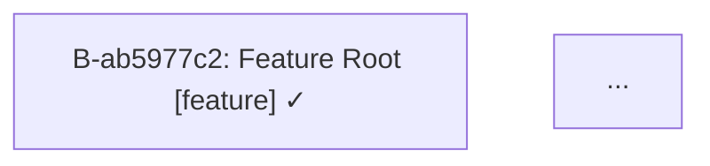

# Bead Graph Diagram

## Objective

Add an `orchestrator bead graph` command that renders a feature tree (or the full bead graph) as a Mermaid diagram. The diagram shows bead relationships, agent types, and execution status at a point in time.

## Command

```bash
orchestrator bead graph --feature-root <id>        # feature tree only
orchestrator bead graph                             # all beads
orchestrator bead graph --feature-root <id> --output graph.md
```

The command is a subcommand of `bead`, consistent with `bead show` and `bead list`.

## Node Format

Each node uses this label:

```
<bead_id>: <truncated_title> [<agent_type>] <status_icon>
```

- `bead_id`: full bead ID
- `truncated_title`: title truncated to 40 characters with `...` if longer
- `agent_type`: one of `planner`, `developer`, `tester`, `documentation`, `review`, `feature`
- `status_icon`: single character indicating current status

| Status | Icon |
|---|---|
| `done` | `✓` |
| `in_progress` | `⚙` |
| `blocked` | `✗` |
| `ready` | `·` |
| `open` | `○` |
| `handed_off` | `→` |

Example node label:
```
B-f3dd3a34: Seed Known Issues Memory File [documentation] ✓
```

Example with truncation:
```
B-fe943df9: Propagate touched_files to shared fo... [developer] ✓
```

## Edges

- **Solid arrow** (`-->`) — planned dependency (bead A depends on bead B)
- **Dotted arrow** (`-.->`) — corrective relationship (bead is a corrective child of a blocked bead)

A corrective bead is identified by its ID containing the `corrective_suffix` from config (default: `-corrective`).

## Output Modes

### Stdout (default)

Prints raw Mermaid syntax to stdout with no wrapping:

```
graph TD
  B-ab5977c2["B-ab5977c2: Feature Root [feature] ✓"]
  ...
  B-ab5977c2 --> B-f3dd3a34
  ...
```

### File output (`--output <path>`)

Writes the diagram wrapped in a Mermaid fenced code block to the specified file:

````

````

If the file already exists it is overwritten.

## Graph Layout

- Direction: top-down (`graph TD`)
- Epic/planner beads appear at the top as roots
- Feature root beads appear below the epic
- Child beads flow downward following dependency order
- Corrective beads are children of their parent blocked bead via dotted edges
- Orphan beads (no feature root, no parent) appear as isolated nodes at the bottom of the graph

## Scope

### `--feature-root <id>`

Include only beads whose `feature_root_id` matches the given ID, plus the epic bead that is the parent of the feature root (if it exists). Partial ID prefix resolution via `RepositoryStorage.resolve_bead_id()` is supported.

### No `--feature-root`

Include all beads in storage.

## Node ID Sanitisation

Mermaid node IDs must not contain hyphens in certain contexts. Replace hyphens in bead IDs with underscores for the Mermaid node identifier, while keeping the original ID in the label:

```
B_ab5977c2["B-ab5977c2: Feature Root [feature] ✓"]
```

## Implementation

### New function: `render_bead_graph(beads, config) -> str`

In `src/codex_orchestrator/cli.py` or a new `src/codex_orchestrator/graph.py` module.

Inputs:
- `beads: list[Bead]` — the beads to render
- `config: SchedulerConfig` — to read `corrective_suffix`

Returns: raw Mermaid string (no fencing).

Logic:
1. Emit `graph TD`
2. For each bead, emit the node definition line
3. For each bead with dependencies, emit `-->` edges for each dependency that appears in the bead list
4. For each bead whose ID ends with the corrective suffix pattern, emit a `-.->` edge to its parent bead
5. Dependencies that reference beads outside the filtered set are silently omitted

### CLI wiring

In `cli.py`, add `bead graph` as a subcommand of the `bead` subparser:

```
parser_bead_graph = bead_subparsers.add_parser("graph", help="Render bead graph as Mermaid diagram")
parser_bead_graph.add_argument("--feature-root", dest="feature_root")
parser_bead_graph.add_argument("--output", dest="output_path")
```

Command handler:
1. Load all beads from storage
2. If `--feature-root` given, resolve the ID, then filter beads to those with matching `feature_root_id` plus the epic parent
3. Call `render_bead_graph(beads, config.scheduler)`
4. If `--output` given, wrap in fenced block and write to file; print confirmation to stderr
5. If no `--output`, print raw Mermaid to stdout

## Files to Modify

| File | Change |
|---|---|
| `src/codex_orchestrator/cli.py` | Add `bead graph` subcommand and handler |
| `src/codex_orchestrator/graph.py` | New module: `render_bead_graph()` function |
| `tests/test_orchestrator.py` | Tests for `render_bead_graph()` |

## Acceptance Criteria

- `orchestrator bead graph --feature-root <id>` prints valid Mermaid to stdout
- `orchestrator bead graph --feature-root <id> --output out.md` writes a fenced Mermaid block to `out.md`
- `orchestrator bead graph` with no `--feature-root` renders all beads
- Titles longer than 40 characters are truncated with `...`
- Status icons are correct for all 6 status values
- Corrective beads use dotted edges (`-.->`) to their parent
- Planned dependency edges use solid arrows (`-->`)
- Orphan beads (no feature root) appear as isolated nodes
- Hyphens in bead IDs are replaced with underscores in Mermaid node identifiers
- Epic/planner beads are included when `--feature-root` is specified
- Partial bead ID prefix resolution works for `--feature-root`
- All existing tests pass
